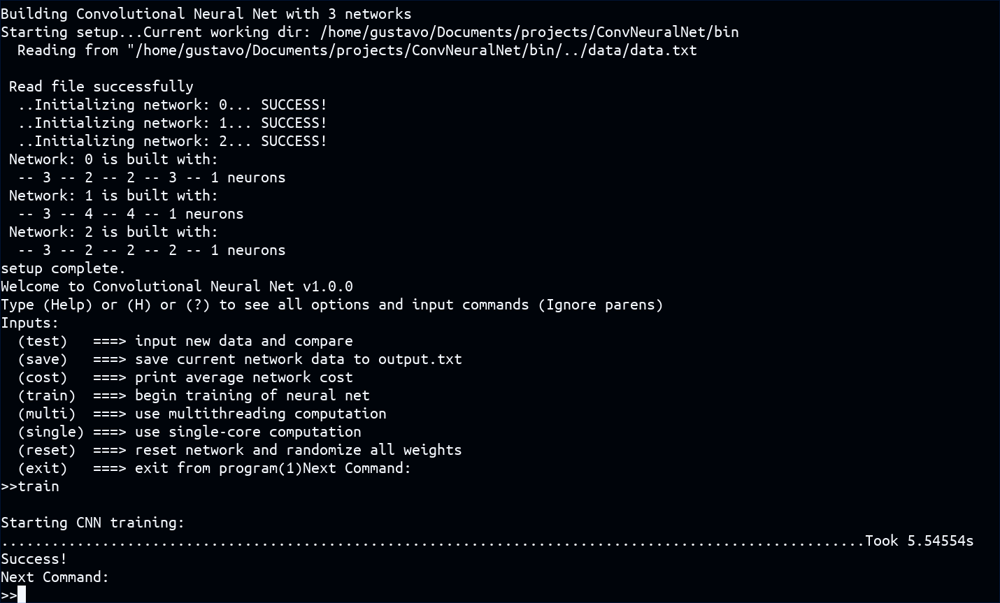

# ConvNeuralNet
Graphical Visualization of a Convolutional Neural Network in C++

Terminal simulation of a Convolutional Neural Network in C++

# **About**
	This project is split up into two forms: Graphical (using openFrameworks) and Terminal (shell)
# **Requires (Graphical)** 
  	OpenFrameworks v0.10.1 ==> openframeworks.cc/download/
	Place the OF directory in your home directory ~/ or edit the OF_ROOT in the Makefile
# **Requires (Terminal)** 
  	g++ with a bash terminal
# **INSTALL: (Graphical)**
	run *./graphical.sh* in the project directory, then enter bin/ to run */graphical*
# **INSTALL: (terminal)**
	run *./terminal.sh* in the project directory, then enter bin/ to run */terminal*

# **HOW TO USE:**
  	To use custom datasets simply modify/replace the *data.txt* file in data/.
**REQUIREMENTS:**
	The format of the dataset should be "x1 x2 ... xn ; y1 y2 ... ym " on every line
	Where spaces are used to divide the individual data entries and the semicolon (;) divides inputs against outputs.

# **Controls: (Graphical)**
**PRESS (H) (h) (?) to see this from the terminal**
**SPACE:**\
	Iterate through dataset and run into model.\
**BACKSPACE:**\
	Compute total average cost, where cost function is the difference in squares\
**RT_SHIFT:**\
	Begin training on dataset\
**ENTER:**\
	Randomize weights on entire Neural Net\
**ESC:**\
	Exit application
# **Controls: (Terminal)**
  	All the information for input commands should be presented upon program launch
	Or simply type 'help', 'H', or '?'